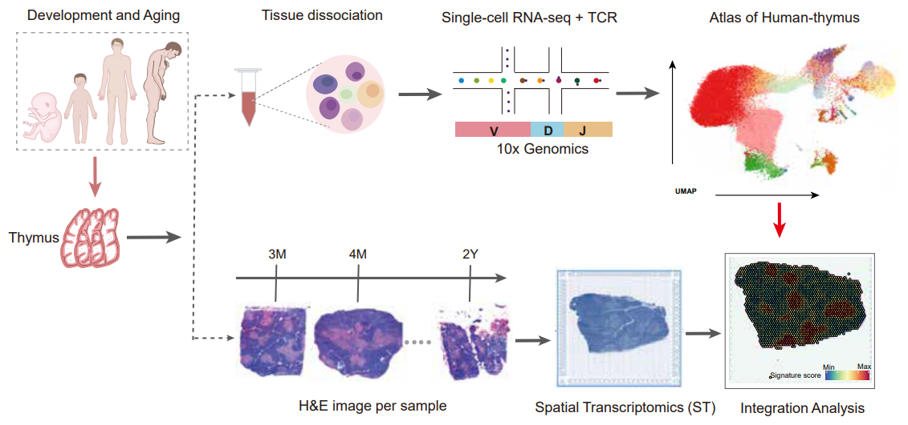
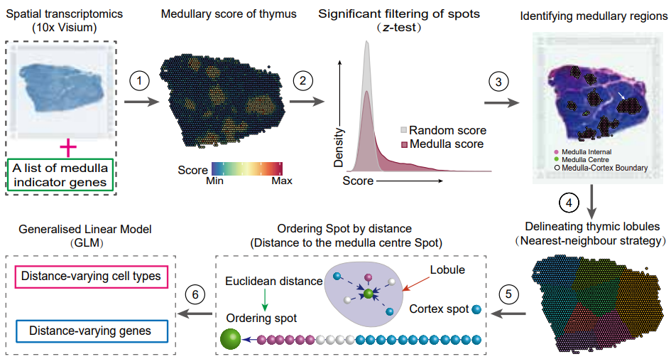
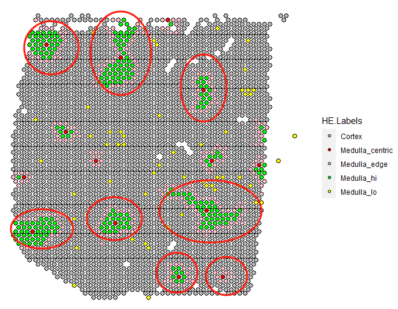

# Thymus
***Unraveling the spatial organization and development of human thymocytes through integration of spatial transcriptomics and single-cell multi-omics profiling.***

<p align="center">
	
</p>

### ***Data Availability and Citation***

(1). All the analysis codes used in our study are provided in the `source.code` directory. Raw sequencing and preprocessed data can be obtained from the provided URL: https://ngdc.cncb.ac.cn/bioproject/.

(2). <b>【CITATION】</b>: ***Li et al. Unraveling the spatial organization and development of human thymocytes through integration of spatial transcriptomics and single-cell multi-omics profiling[J]. Nature communication, 2024.***<br>

-----
# TSO-His

TSO-his is a specialized tool designed for the identification of the cortex, medulla, and corticomedullary junction regions in thymic ST sections. This tool leverages statistical testing and network search algorithms to achieve its functionality.

<p align="center">
	
</p>

## 1. How to install?

``` r
library(devtools)
install_github("lihuamei/Thymus/thymusTSO")

``` 

## 2. Loading `thymusTSO` package and testing
``` r
library(thymusTSO)
library(dplyr)

sp.obj <- system.file('data/thymus_T2.RDS', package = 'thymusTSO') %>% readRDS
sp.obj <- tsoHis(sp.obj)
SpatialPlot(sp.obj[[1]], group.by = 'HE.Labels', cols = c('grey', 'red', 'green', 'pink', 'yellow') %>% `names<-`(unique(sp.obj[[1]]$HE.Labels))

fitDistLinesByGlm(sp.obj, plot.tar = c('CCL25', 'CCL19', 'CD19', 'RAG1'), degree = 4)
fitDistLinesByWindows(sp.obj, plot.tar = c('CCL25', 'CCL19', 'CD19', 'RAG1'), win = 20)

``` 
<p align="center">
	
</p>

<b> If calling XGBoost model for predicting cortical and medullary spots, please set `call.xgb = TRUE`. </b>

``` r
sp.obj <- tsoHis(sp.obj, call.xgb = TRUE)

``` 
## 3. Session infos
```r
> sessionInfo()
R version 4.2.2 (2022-10-31 ucrt)
Platform: x86_64-w64-mingw32/x64 (64-bit)
Running under: Windows 10 x64 (build 22000)

Matrix products: default

locale:
[1] LC_COLLATE=Chinese (Simplified)_China.utf8  LC_CTYPE=Chinese (Simplified)_China.utf8   
[3] LC_MONETARY=Chinese (Simplified)_China.utf8 LC_NUMERIC=C                               
[5] LC_TIME=Chinese (Simplified)_China.utf8    

attached base packages:
[1] splines   stats     graphics  grDevices utils     datasets  methods   base     

other attached packages:
 [1] thymusTSO_1.0.0        randomcoloR_1.1.0.1    DiagrammeR_1.0.10      tidyr_1.3.0           
 [5] devtools_2.4.5         usethis_2.2.2          caret_6.0-94           lattice_0.21-8        
 [9] ggplot2_3.4.2          Seurat_4.3.0.1         SeuratObject_5.0.1     sp_2.1-3              
[13] FeatureSelection_1.0.0 verification_1.42      dtw_1.23-1             proxy_0.4-27          
[17] CircStats_0.2-6        MASS_7.3-60            boot_1.3-28.1          fields_14.1           
[21] viridis_0.6.3          viridisLite_0.4.2      spam_2.10-0            dplyr_1.1.0           
[25] xgboost_1.7.5.1       

loaded via a namespace (and not attached):
  [1] utf8_1.2.3             spatstat.explore_3.2-1 reticulate_1.38.0      R.utils_2.12.2        
  [5] tidyselect_1.2.0       htmlwidgets_1.6.2      grid_4.2.2             ranger_0.15.1         
  [9] Rtsne_0.16             pROC_1.18.4            munsell_0.5.0          codetools_0.2-19      
 [13] ica_1.0-3              future_1.33.1          miniUI_0.1.1.1         withr_2.5.0           
 [17] spatstat.random_3.1-5  colorspace_2.1-0       progressr_0.14.0       knitr_1.43            
 [21] rstudioapi_0.15.0      stats4_4.2.2           ROCR_1.0-11            tensor_1.5            
 [25] listenv_0.9.1          labeling_0.4.2         polyclip_1.10-4        farver_2.1.1          
 [29] rprojroot_2.0.3        parallelly_1.37.1      vctrs_0.6.3            generics_0.1.3        
 [33] xfun_0.39              ipred_0.9-14           timechange_0.2.0       R6_2.5.1              
 [37] doParallel_1.0.17      spatstat.utils_3.0-3   cachem_1.0.7           promises_1.2.0.1      
 [41] scales_1.2.1           nnet_7.3-19            gtable_0.3.3           globals_0.16.3        
 [45] processx_3.8.2         goftest_1.2-3          timeDate_4022.108      rlang_1.1.1           
 [49] lazyeval_0.2.2         ModelMetrics_1.2.2.2   spatstat.geom_3.2-2    reshape2_1.4.4        
 [53] abind_1.4-5            httpuv_1.6.11          tools_4.2.2            lava_1.7.2.1          
 [57] ellipsis_0.3.2         RColorBrewer_1.1-3     sessioninfo_1.2.2      ggridges_0.5.4        
 [61] Rcpp_1.0.10            plyr_1.8.8             visNetwork_2.1.2       purrr_1.0.1           
 [65] ps_1.7.5               prettyunits_1.1.1      rpart_4.1.19           deldir_1.0-9          
 [69] pbapply_1.7-2          cowplot_1.1.1          urlchecker_1.0.1       zoo_1.8-12            
 [73] ggrepel_0.9.3          cluster_2.1.4          fs_1.6.2               magrittr_2.0.3        
 [77] data.table_1.14.8      scattermore_1.2        lmtest_0.9-40          RANN_2.6.1            
 [81] fitdistrplus_1.1-11    R.cache_0.16.0         matrixStats_1.0.0      pkgload_1.3.2.1       
 [85] patchwork_1.1.2        mime_0.12              xtable_1.8-4           gridExtra_2.3         
 [89] shape_1.4.6            testthat_3.1.10        compiler_4.2.2         tibble_3.2.1          
 [93] maps_3.4.1             V8_4.3.3               KernSmooth_2.23-22     crayon_1.5.2          
 [97] R.oo_1.25.0            htmltools_0.5.5        mgcv_1.9-0             later_1.3.1           
[101] lubridate_1.9.2        Matrix_1.6-5           brio_1.1.3             cli_3.6.0             
[105] R.methodsS3_1.8.2      parallel_4.2.2         dotCall64_1.1-1        gower_1.0.1           
[109] igraph_1.5.0           pkgconfig_2.0.3        plotly_4.10.2          spatstat.sparse_3.0-2 
[113] recipes_1.0.6          xml2_1.3.3             roxygen2_7.2.3         foreach_1.5.2         
[117] hardhat_1.3.0          prodlim_2023.03.31     stringr_1.5.0          callr_3.7.3           
[121] digest_0.6.31          sctransform_0.3.5      RcppAnnoy_0.0.21       spatstat.data_3.0-1   
[125] leiden_0.4.3           uwot_0.1.16            curl_5.0.0             shiny_1.7.4.1         
[129] lifecycle_1.0.4        nlme_3.1-162           jsonlite_1.8.7         desc_1.4.2            
[133] fansi_1.0.4            pillar_1.9.0           fastmap_1.1.1          httr_1.4.6            
[137] pkgbuild_1.4.2         survival_3.5-5         glue_1.6.2             remotes_2.4.2.1       
[141] png_0.1-8              iterators_1.0.14       glmnet_4.1-7           class_7.3-22          
[145] stringi_1.7.12         profvis_0.3.8          memoise_2.0.1          styler_1.10.3         
[149] irlba_2.3.5.1          e1071_1.7-13           future.apply_1.11.1   

```
## 4. Contact
Please feel free to contact us at the following email address: qingx@tcrximmune.cn; li_hua_mei@163.com.
